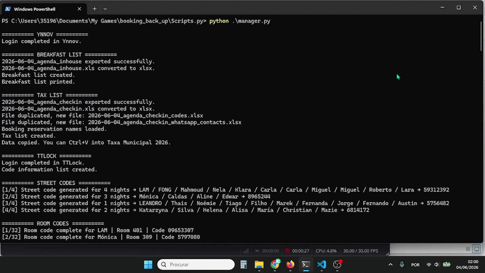

# HC63 Hostel Operations Automation Pipeline

I have built a Python automation pipeline to streamline daily hostel operations at **Castilho Hostel & Suites 63**.

This project automates the workflow from raw reservation exports to breakfast and city tax processing, access-code generation, printed operational documents, VCF contact generation, and WhatsApp guest communication.

The system is used internally and was designed to reduce manual workload and human error while making daily operations faster and more reliable.

Below is the access-code automation in action — one of the highest-impact parts of the pipeline.

 

## VCF Contact Generation and Delivery

Automated contact generation and delivery as part of the guest communication workflow.

 

## Complete Pipeline Execution Output

The CLI output of the full automation pipeline running from reservation export to final cleanup.

---

## 🚀 Impact

The automation reduced a workflow that previously took approximately:

- **1h30 of concentrated work for me**
- **Up to 3h for a less computer-experienced person**

to approximately:

- **8 minutes of automated execution**

---

<!-- HC63_METRICS_START -->

## 📈 Value Created

🥐 **106 Breakfast Lists Generated**  
💶 **104 City Tax Lists Processed**  
🔑 **3843 Guest Access Codes Generated**  
📇 **87 VCF Contact Files Created**  
💬 **94 WhatsApp Messages Sent***  (discontinued)

⏱️ **~257 Hours of Manual Work Saved**

Statistics last updated: 2026-08-26

<!-- HC63_METRICS_END -->

## 🏛️ General Architecture

The pipeline is coordinated by a central orchestrator, manager.py, which manages the full workflow:

- Creating the daily log file if it does not exist
- Checking required environment credentials
- Logging into Ynnov, the reservation platform
- Exporting, converting and duplicating Excel files for each automation stage
- Creating and printing the breakfast list
- Creating and setting the city tax list
- Logging into TTLock, the access-code platform
- Parsing reservation data and generating all required access codes
- Inserting generated codes into a Word template and printing the final document
- Creating and sending the VCF contact file
- Parsing guest contacts and sending WhatsApp messages
- Cleaning temporary files safely
- Committing and pushing the daily execution log to a dedicated repository for centralized execution history

---

# <h1 align="center">🔗 Full Automation Flow</h1>

## 📥 Reservation Platform Login and Data Export

The automation logs into **Ynnov**, the PMS used to manage reservations.

From there, it exports two `.xls` files:

1. A file containing all guests currently staying in the hostel
2. A file containing all guests checking in the next day

These files are then converted to `.xlsx` and duplicated depending on the operational task they will support.

---

## 🥐 Breakfast List Generation

The automation creates a breakfast list containing:

- Guest names
- Number of adults
- Number of children
- Room information
- Total number of people

The script also parses and cleans invalid entries, removing guests who should not appear in the breakfast list for several operational reasons.

After the list is generated, it is printed automatically.

<table align="center" width="25%">
<tr>
<td align="center">
    <strong>Breakfast List</strong>
</td>
</tr>
<tr>
<td align="center">
    
</td>
</tr>
</table>

---

## 💶 City Tax List Generation

The tax list is generated from reservation data and contains:

- Guest names
- Dates
- Tax values to be paid
- Booking reservation ID
- Property associated with the reservation

    <strong>City Tax List</strong>

---

## 🔑 Door Code Automation

The heart of the pipeline is the access code automation.

Starting from a copied `.xlsx` file, the system parses the reservation data to extract and normalize:

- Guest first name
- Number of nights
- Room name in a presentable format
- Reservation grouping information

The automation then groups guests by number of nights and creates a shared **street door code** for each group.

After that, it processes each reservation individually and creates a specific **room code** for each guest, with:

- The correct number of nights
- The correct room
- The correct guest assignment

Creating a single guest code manually requires around 50 clicks and/or key presses.

Each code creation is wrapped in error handling so that if one code fails, the automation logs the problem and continues instead of crashing the entire pipeline.

---

## 📄 Code List Generation

The automation generates a final code.xlsx file:

<table>
<tr>

<td width="45%" valign="top">

<table>
<tr><th>Column</th><th>Data</th></tr>
<tr><td>A</td><td>Guest Name</td></tr>
<tr><td>B</td><td>Room</td></tr>
<tr><td>C</td><td>Number of Nights</td></tr>
<tr><td>D</td><td>Room Code</td></tr>
<tr><td>E</td><td>Street Code</td></tr>
</table>

</td>

<td width="55%" valign="middle">

This information is then inserted into a pre-existing Word document template.

  

The automation fills the table in the correct format and ensures that the final document is ready to be printed and used by the team.

</td>

</tr>
</table>

 

If the table is completed successfully, the code list is printed automatically.

 

<table>
<tr>
<td width="50%" align="center"><strong>Generated Template</strong></td>
<td width="50%" align="center"><strong>Final Printed Operational Document</strong></td>
</tr>
<tr>
<td width="50%" align="center">
    
</td>
<td width="50%" align="center">
    
</td>
</tr>
</table>

---

## 📱 WhatsApp and VCF Contact Automation

For a separate remote-check-in property, the automation extracts the guests associated with the remote property and formats:

- Names
- Phone numbers
- Room information

It then creates a `.vcf` contact file containing all required guest contacts.

The file is sent to the Hostel's WhatsApp, opened on the phone, and imported directly into the contacts list.

This allows multiple guest contacts to be created almost instantly instead of manually registering each one.

After that, the automation uses WhatsApp Web links to send the first remote check-in message to each guest.

To reduce the risk of being blocked or flagged by WhatsApp, messages are sent with a randomized delay between **8 and 10 seconds**.

<!-- WhatsApp messages sent -->

---

## 🛠 Technologies and Integrations

| Core Technologies        | Integrations & Automation            |
| ------------------------ | ------------------------------------ |
| Python                   | Ynnov PMS                            |
| Selenium                 | TTLock                               |
| openpyxl                 | WhatsApp Web                         |
| Excel / XLSX processing  | VCF contact generation               |
| Word document automation | Windows printing and file operations |

---

## 📊 Excel Processing and Data Transformation

Reservation exports require cleaning, filtering, conversion, and restructuring before they can be used by the different automation stages.

The pipeline handles `.xls` to `.xlsx` conversion, workflow-specific file duplication, keyword-based row filtering, guest selection and grouping, and the generation of structured operational outputs.

Because Excel files act as the source of truth between automation stages, data integrity and consistent transformations are essential to the reliability of the entire pipeline.

---

## 🌐 Real-World Workflow Design

Building an automation that works once is relatively straightforward. The real challenge was making HC63 reliable enough to be trusted as part of the daily operational workflow.

Achieving consistent execution required continuous improvement of browser interactions, failure isolation, logging, recovery behavior, and cleanup logic as the system encountered real-world conditions.

The system also had to integrate with the existing hostel workflow without forcing the team to change how daily work was performed. It was designed around existing PMS exports, document templates, printing requirements, WhatsApp workflows, access-code systems, and manual fallback procedures.

This constraint strongly influenced the architecture: HC63 automates the repetitive work while preserving the tools, outputs, and recovery paths already used by the team.

---

## 🛡️ Reliability and Recovery Strategy

The automation is designed to continue whenever partial recovery is possible instead of terminating the entire workflow after a localized failure.

Logging and localized error handling isolate failures so that one failed section or individual guest operation does not necessarily prevent the remaining workflow from completing. This is especially important during access code generation, where guests are processed individually.

At the end of execution, temporary files that are no longer needed are removed safely. However, useful generated files, especially the code list, are intentionally preserved when their corresponding stage fails.

This allows valid intermediate results to remain available for manual use, supports debugging, and ensures that operational work can still be completed when part of the automation fails.

> Avoid total failure whenever partial recovery is possible.

This approach is essential because the project operates in a real business environment where the underlying work still needs to be completed even when one part of the automation encounters an error.

## 🔒 Repository and Security Note

Credentials are stored in environment variables instead of being hardcoded in the source code. Before execution, the system verifies that all required credentials are available, preventing incomplete runs caused by missing configuration.

This repository does not contain the full private production source code. The project is used internally in a real business environment, and the complete implementation includes operational details, workflows, integrations, and other production-specific information that are not appropriate to publish publicly.

This repository exists as a technical overview and portfolio presentation of the project's architecture, workflow, engineering decisions, and operational impact.

---

## 👤 Author

- João Muñoz
